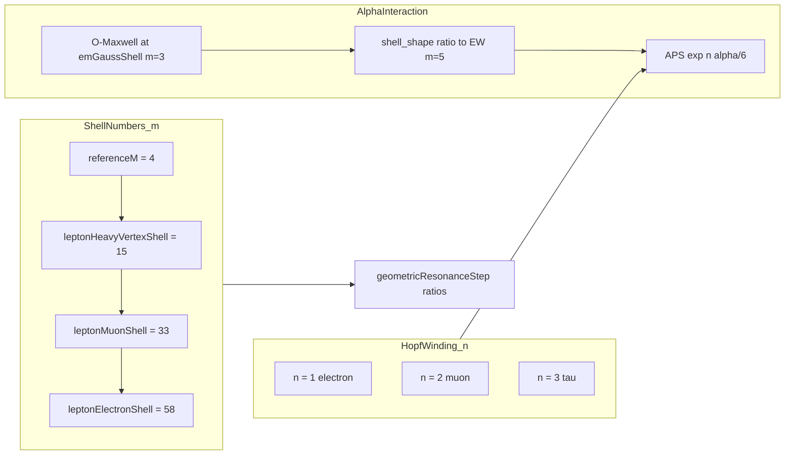
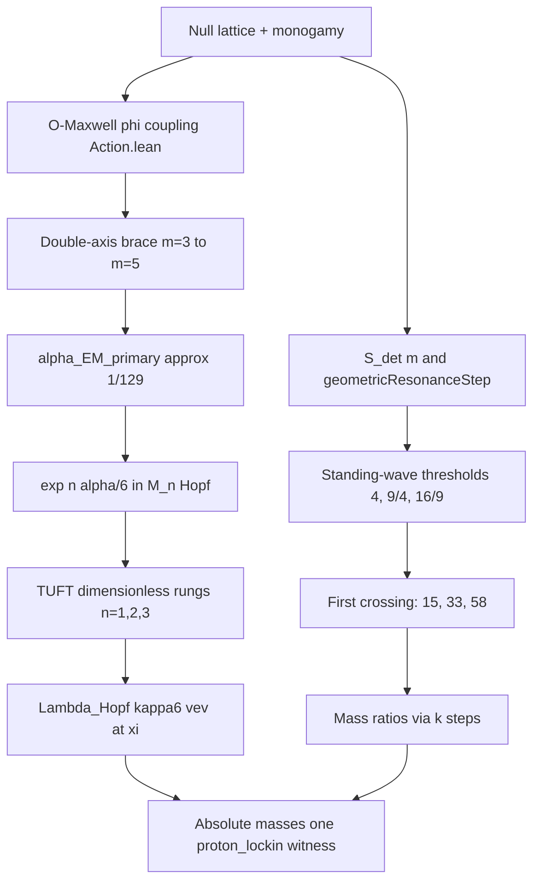

# Alpha–Lepton Shell Selection (HQIV / TUFT)

**Status:** selection-machinery note (agent-facing). **Not** a physical uniqueness proof.

**Scope:** how the repo **currently picks** charged-lepton shells (15 / 33 / 58) and α_EM readouts, what Lean actually certifies, and what would be required for a genuine derivation. Quark shell tables remain witness-heavy and are out of scope here.

**Related:** [O_MAXWELL_EIGEN_SHELL_SELECTION.md](./O_MAXWELL_EIGEN_SHELL_SELECTION.md), [TUFT_HOPF_SPECTRAL_MINING.md](./TUFT_HOPF_SPECTRAL_MINING.md), [TUFT_INNER_OUTER_CASIMIR_DYNAMICS.md](./TUFT_INNER_OUTER_CASIMIR_DYNAMICS.md), [ASSUMPTIONS.md](./ASSUMPTIONS.md) §1b (single active scale witness).

---

## 0. Honest limit — this is **not** a “why 15, 33, 58” proof

If the question is *“why must nature use these shells, and are they unique?”* — **HQIV does not answer that yet.** The Lean theorems prove something narrower:

| What Lean **does** prove | What Lean **does not** prove |
|--------------------------|------------------------------|
| **Given** the detuned ladder, thresholds, and `Nat.find` rule, the selected shells are **uniquely** 15, 33, 58 (`interval_cases` + `firstShellAtOrAboveResonanceThreshold_min`) | That the detuned law `S/(1+γm/2)` is the **only** correct effective surface from full O–Maxwell dynamics |
| Minimality **within the rule**: no smaller `m'` above the baseline satisfies the threshold | That **first crossing** is the correct physical selection (vs band peak, variational minimum, eigenmode, etc.) |
| Thresholds 4, 9/4, 16/9 follow from **assigned** standing-wave ranks τ→2, μ→3, e→4 | That those ranks are **forced** by Fano/triality/Hopf data (they are modeling choices today) |
| `referenceM = 4` from ≥40-mode capacity **given** `qcdShell=1`, `latticeStepCount=3` | That those substrate pins are the **only** physically allowed pins |

So 15 / 33 / 58 are **outputs of a parameterized selector**, not conclusions from a closed variational or spectral problem. Changing any of these inputs changes the shells:

- different detuning law → different crossing points;
- different rank assignment → different thresholds;
- different rule (second crossing, band centre, modal peak) → different `m`.

**Same honesty for α:** `one_over_alpha_EM_double_axis` is algebra on **chosen chart shells** (Gauss `m=3`, EW `m=5`) plus O–Maxwell φ-log. It is an **interaction brace between two conventions**, not a proof that α must be 1/129. Matching CODATA 137 is a separate scale/regime question.

**What a real derivation would require** (see `O_MAXWELL_EIGEN_SHELL_SELECTION.md` §6):

1. A **closed modal functional** or **dispersion relation** from full 8-channel O–Maxwell + φ + null lattice whose **solutions** (peaks / eigenconditions) **force** shell indices or bands — then the table becomes certified output.
2. Or: prove standing-wave rank assignment from **Spin(8)/Fano channel + fermion statistics**, not by declaration.

Until then, call the pipeline what it is: **witness/readout scaffolding with internal arithmetic consistency**, not fitted PDG numbers but also **not** physical uniqueness.

**Atom program:** the heavy-decay template (fixed registry + discharge product + uniqueness theorem) applies to **chemistry/electronic structure** via `papers/nucleon_binding` + `Hqiv/QuantumChemistry/*` — see [ATOM_CONSTRUCTION_FROM_MATH.md](./ATOM_CONSTRUCTION_FROM_MATH.md). Atoms should **not** route through lepton 15/33/58; they route through **TUFT electronic chart + Z discharge + continuous ξ**.

---

## 1. Executive distinction

HQIV uses **two independent but coupled coordinates** for charged leptons and EM:

| Coordinate | What it indexes | Typical values | Role |
|------------|-----------------|----------------|------|
| **Hopf fibre winding** `n` | TUFT generation sector on contact Beltrami shells | `n = 1, 2, 3` (e, μ, τ) | Sector zeta determinant, APS spurion `exp(n α/6)`, g−2 |
| **Outer-horizon support shell** `m` | Detuned-surface readout on the null-lattice ladder | **15 → 33 → 58** (τ → μ → e) | Mass **ratios** via `geometricResonanceStep` |

**α_EM is neither.** Fine-structure coupling is an **interaction** between chart points (Gauss EM row ↔ EW row), Fano vertices (7×7 holonomy/line system), and TUFT winding × EM boundary (APS term). It is **not** “the value of α at the electron shell `m = 58`.”



---

## 2. Substrate pins (below shell selection)

These are **named discrete inputs**, not PDG fits:

| Name | Value | Lean | Status |
|------|-------|------|--------|
| `qcdShell` | 1 | `OctonionicLightCone` | Pin |
| `latticeStepCount` | 3 | `OctonionicLightCone` | Pin (= cube axes) |
| `referenceM` | **4** | `referenceM := qcdShell + latticeStepCount` | Pin + **capacity theorem** |
| `alpha` | 3/5 | `Hqiv.alpha` | Proved |
| `gamma_HQIV` | 2/5 | `Hqiv.gamma_HQIV` | Proved |
| `1/alpha_GUT` | 42 | `SM_GR_Unification` | Proved |

**Capacity theorem (partial “why 4”):** `referenceM_first_shell_with_sector_capacity` — `referenceM` is the **minimal** shell with `new_modes ≥ 40`. This is combinatorics on the null lattice, not a proton-mass fit. Changing `qcdShell` or `latticeStepCount` moves which row is “reference.”

**Chart honesty:** `referenceM = 4` coincides with `tuftHeavyChartShell = 4` (`TuftShellChart`) under current pins, but the two are **different APIs** — hadronic/cosmology export vs TUFT Beltrami chart `m = n + 1`. Do not merge without explicit decoupling.

---

## 3. Charged-lepton shell **selection** (proved arithmetic, open physics)

This section documents the **active selector** and what it certifies. Read §0 first.

### 3.1 Detuned ladder (shared machinery)

From `FanoResonance.lean`:

\[
S(m) = (m+1)(m+2), \qquad
S_{\mathrm{det}}(m) = \frac{S(m)}{1 + (\gamma/2)\,m}, \qquad
\gamma = \frac{2}{5}.
\]

**Resonance step** (lighter generation = larger outer shell in numerator):

\[
k(m_{\mathrm{from}}, m_{\mathrm{to}}) =
  \mathrm{geometricResonanceStep}(m_{\mathrm{from}}, m_{\mathrm{to}})
  = \frac{S_{\mathrm{det}}(m_{\mathrm{from}})}{S_{\mathrm{det}}(m_{\mathrm{to}})}.
\]

**Proved emergence:** `sectorGaussianLeadingWeight m = detunedShellSurface m` (`FanoSectorSpectralMassEmergence`) — the detuned surface is the **O–Maxwell Fano 1-jet quotient** `S(m) / omaxwellFanoDetuning1Jet m`, not an independent postulate.

### 3.2 Standing-wave thresholds (no PDG)

From `LeptonGenerationLockin.lean`:

- **S² cumulative mode budget** at rank `r`: `standingWaveModeBudget r = sphericalHarmonicCumulativeCount (r - 1)`.
- Ranks: spin-only `1 → 1`, charge-decorated `2 → 4`; lepton generations τ/μ/e use ranks `2 → 4`, `3 → 9`, `4 → 16`.

**Thresholds (proved numerically):**

| Step | Threshold | Formula | Theorem |
|------|-----------|---------|---------|
| baseline → τ | **4** | `chargeDecoratedStandingWaveLift` | `chargeDecoratedStandingWaveLift_eq_four` |
| τ → μ | **9/4** | `9/4` mode ratio | `chargedLeptonTauMuThreshold_value` |
| μ → e | **16/9** | `16/9` mode ratio | `chargedLeptonMuEThreshold_value` |

### 3.3 First-crossing selector

**Predicate:** `current_m < m'` and `threshold ≤ geometricResonanceStep m' current_m` (`leptonResonanceThresholdPred`).

**Selector:** `firstShellAtOrAboveResonanceThreshold current_m threshold` = `Nat.find` on existence (`exists_leptonResonanceThresholdPred`).

**Baseline:** `spinOnlyBaselineShell := referenceM` (= 4).

**Derived shells:**

```text
leptonHeavyVertexShell :=
  firstShellAtOrAboveResonanceThreshold referenceM 4

derivedLeptonMuonShell :=
  firstShellAtOrAboveResonanceThreshold leptonHeavyVertexShell (9/4)

derivedLeptonElectronShell :=
  firstShellAtOrAboveResonanceThreshold derivedLeptonMuonShell (16/9)
```

**Proved numeric outputs** (`ChargedLeptonResonance.lean`) — *uniqueness of `Nat.find` given the rule, not uniqueness in nature*:

| Shell | `m` | Theorem | Proof style |
|-------|-----|---------|-------------|
| τ heavy vertex | **15** | `leptonHeavyVertexShell_eq_fifteen` | `Nat.le_antisymm` + `interval_cases` on shells 5…14 failing threshold 4 |
| μ | **33** | `derivedLeptonMuonShell_eq_thirtyThree` | same on shells 16…32 failing 9/4 |
| e | **58** | `derivedLeptonElectronShell_eq_fiftyEight` | same on shells 34…57 failing 16/9 |

**Active export:** `currentOuterHorizonLeptonShellSelection` = `thresholdDerivedOuterHorizonLeptonShellSelection`; `leptonMuonShell` / `leptonElectronShell` alias the derived values.

**Physical reading (intent, not proved):** lighter charged leptons on **higher/outer** shells (58 > 33 > 15 > 4). Modal quarter-period support exists at each representative shell (`*_has_modal_closed_surface_support`), but that support condition is **generic** — it does not **select** the shell (see `LeptonGenerationLockin` module doc on `modalQuarterClosedSurfaceSupport`).

### 3.4 Injected conventions (the “fit” layer)

These are the parameters that **determine** 15/33/58 before any PDG comparison:

| Convention | Value | Where | Forced by axioms? |
|------------|-------|-------|-------------------|
| Detuned denominator | `1 + (γ/2)m` | `FanoResonance.detunedShellSurface` | **No** — proved as 1-jet **quotient identity**, not as unique dynamics |
| Selection rule | first `m'` with `k(m',m) ≥ threshold` | `firstShellAtOrAboveResonanceThreshold` | **No** — explicit algorithm |
| τ baseline threshold | 4 | charge-decorated / spin-only rank ratio | **No** — ranks 2 and 1 assigned |
| τ→μ threshold | 9/4 | ranks 3 and 2 | **No** |
| μ→e threshold | 16/9 | ranks 4 and 3 | **No** |
| Generation → rank map | τ→2, μ→3, e→4 | `chargedLeptonStandingWaveRank` | **No** — “higher overtones outward” narrative |

PDG is **not** in this list — but the **structure** (threshold ladder + first crossing) is chosen so the resulting ratios land near experiment. That is **reverse-engineered scaffolding**, not ab initio uniqueness.

### 3.5 What is still open on shells

| Item | Status |
|------|--------|
| **Physical uniqueness** of shell indices | **Open** — central gap |
| Threshold proxy vs genuine closed-surface / eigenmode selection | Open — `thresholdProxyClosedSurfaceSupport` documents it |
| Full modal eigen-shell emergence from 8-channel O–Maxwell | Open — 1-jet quotient **proved**, full spectrum **not** |
| Standing-wave ranks from Fano/Spin(8) | Open — ranks are **defs** today |
| Absolute charged-lepton GeV scale | Witness — `m_tau_from_resonance` (PDG comparison) |
| Legacy provisional `+1` ladder (16, 17) | Retired — not active |

---

## 4. α_EM as interaction (not shell occupancy)

### 4.1 Lattice α vs fine-structure α

| Symbol | Meaning |
|--------|---------|
| `Hqiv.alpha = 3/5` | Curvature-imprint / monogamy exponent (global lattice) |
| `alpha_EM_primary` | **Fine-structure coupling** for TUFT sector determinants and APS spurions |

Only the second is “α_EM” in the Thomson/CODATA sense — and even that is **scale-tiered** (see below).

### 4.2 Bare O–Maxwell running (proved algebra)

From `SM_GR_Unification.lean`:

\[
\frac{1}{\alpha_{\mathrm{eff}}(\varphi, c)} =
  \frac{1}{\alpha_{\mathrm{GUT}}}\left(1 + c\,\alpha\,\ln(\varphi+1)\right),
  \quad \frac{1}{\alpha_{\mathrm{GUT}} = 42,\ \varphi(m) = 2(m+1).
\]

Lean: `one_over_alpha_eff`, `one_over_alpha_EM_derived m c`, closed form `one_over_alpha_EM_derived_closed_form`.

The Fano coefficient `c` is per-vertex normalization in the 7×7 coupling system (`scripts/hqiv_coupling_linear_system.py`); default **`c₀ = 1`** under `proton_lockin` (`EffectiveAlphaReadout.defaultFanoAlphaCoeff`).

### 4.3 Double-axis brace (primary α readout)

**Interaction:** evaluate O–Maxwell at the **EM Gauss chart** and multiply by the **shell-shape ratio** to the **EW readout chart**.

From `DoublePreferredAxisAlpha.lean`:

```text
emGaussShell        = referenceM - 1 = 3
electroweakPhiShell = referenceM + 1 = 5

one_over_alpha_EM_double_axis c =
  one_over_alpha_EM_derived emGaussShell c
  * (shell_shape emGaussShell / shell_shape electroweakPhiShell)
```

Expanded (`one_over_alpha_EM_double_axis_default_expands`):

\[
\frac{1}{\alpha} = 42\left(1 + \frac{3}{5}\ln 9\right)\cdot\frac{\sigma(3)}{\sigma(5)} \approx 129.
\]

**Canonical router:** `EffectiveAlphaReadout.alpha_EM_primary` → `alpha_EM_double_axis`; TUFT slot `tuftFineStructureAlphaDerived` / `tuftFineStructureAlpha`.

**Scale witness discipline** (`ScaleWitness`, `ASSUMPTIONS.md`): under **`proton_lockin`**, CODATA `137.036` is a **comparison layer**, not a solve input. Matching CODATA is a **prediction test**.

### 4.4 Continuous ξ chart (alternative brace)

`ContinuousXiCoupling`: `ξ = m + 1`, `continuousBraceInvAlpha c ξG ξEW = oneOverAlphaEffXi ξG c * sigmaRatio ξG ξEW`.

Scan witnesses (numeric, not transcendental proofs):

- `normalizationXiWitness` — ξ_G ≈ 3.47, brace near CODATA ( **`codata_alpha`** mode only)
- `structureXiWitness` — holonomy residual minimum, ξ ≈ 4.85

### 4.5 Why **not** electron shell `m = 58` for α

1. **Bare ladder monotonicity:** `one_over_alpha_EM_derived m` **increases** with `m` (more IR shells → weaker coupling in the φ-log slot). At `m ≈ 20–21` bare O–Maxwell already crosses ~137; at `m = 58` it overshoots CODATA badly.
2. **Role separation:** `58` is the **outer support shell** for the e mass **ratio** readout, not the EM infrastructure chart (Gauss `3`, EW `5`).
3. **TUFT uses winding `n`**, not outer `m`, in `exp(n α/6)`.
4. **Coupling is brace/solve:** α_EM primary is **Gauss ↔ EW interaction**, optionally Fano vertex consistency — never “occupancy at one shell.”

---

## 5. TUFT connection (same interaction logic)

### 5.1 Sector determinant body

From `HopfShellBeltramiMassBridge.lean` (Nielsen Sector Determinant Lemma):

\[
M_n^{\mathrm{Hopf}} = (n+1)\,
  \exp\!\bigl(a n - \zeta(3) n^2\bigr)\,
  \exp\!\bigl(n\,\alpha_{\mathrm{EM}}/6\bigr),
\]

with `tuftHelicityCoefficient`, `tuftAperyZeta3`, and **`tuftFineStructureAlpha`** (= derived primary α).

The **`exp(n α/6)`** factor is the **APS electromagnetic spectral shift** — interaction of **fibre winding sector `n`** with the **EM connection / knot-complement boundary**, not a shell-index lookup.

### 5.2 g−2 spurion

`tuftAnomalousMomentSpurionDerived n c` = `(exp(n α_derived/6) - 1) / max n 1`.

Full T8 readout: `tuftAnomalousMomentFullT8` = spurion × Ray–Singer/torsion subleading ratio (`FanoSectorSpectralMassEmergence`).

### 5.3 Mass composition (dimensionless × scale)

Physical charged-lepton mass at temperature chart `ξ`:

```text
m_n(ξ) = Λ_Hopf(ξ) × (S_n^torsion / S_3^torsion) × M_n^Hopf
```

with `Λ_Hopf = √(2π) · v(ξ) · κ₆` from inner–outer Casimir (`HopfShellBeltramiMassBridge`).

**HQIV mass ratios** on the outer ladder additionally use:

```text
geometricResonanceStep leptonMuonShell leptonHeavyVertexShell
geometricResonanceStep leptonElectronShell leptonMuonShell
```

Proved equal to **sector Gaussian weight ratios** (`geometricResonanceStep_eq_sectorGaussianLeading_ratio`).

---

## 6. End-to-end readout chain (charged leptons + α)



**Single dimensionful witness:** proton at `referenceM` under `proton_lockin` (`ScaleWitness`). PDG/CODATA are comparison only.

---

## 7. Open refinements (respecting HQIV math)

| Target | Intent | Status |
|--------|--------|--------|
| `alpha_EM_aps_interaction` | α from **winding × EM Gauss** brace, aligning TUFT APS with double-axis | Design — not implemented |
| `alpha_EM_ir` | O–Maxwell running from EW brace (~129) to laboratory Thomson scale (~137) without CODATA input | Design — not implemented |
| Modal eigen-shell selection | Full 8-channel spectrum picks support bands, not threshold proxy | Open (`O_MAXWELL_EIGEN_SHELL_SELECTION.md`) |
| Per-shell `HopfShell.curvatureImprintAlpha` | Distinct α_n per winding sector | Scaffold only |
| Closed-surface uniqueness | Replace `Nat.find` threshold with proved standing-wave closure selector | Open |

**Recommended plug-in order** (when implementing):

1. Define interaction readout (brace between **two chart roles**: EM Gauss, EW, or APS response).
2. Thread into `tuftFineStructureAlphaDerived` and Fano 7×7 rows.
3. Keep shell numbers on the **threshold ladder** until modal selection theorem lands.
4. Never use CODATA + proton + CMB in one solve.

---

## 8. Status summary

| Claim | Status |
|-------|--------|
| `referenceM = 4` from ≥40-mode capacity (given pins) | **Proved** |
| 15 / 33 / 58 = **unique output of** first-crossing selector (given ladder + thresholds) | **Proved** (arithmetic) |
| 15 / 33 / 58 = **unique physical** lepton shells | **Not proved** |
| Thresholds 4, 9/4, 16/9 from **assigned** ranks | **Definitional** — not forced |
| `detunedShellSurface` = Fano 1-jet quotient | **Proved** (relative to jet def) |
| `one_over_alpha_EM_derived` closed form | **Proved** |
| Double-axis brace algebra (given shells 3, 5) | **Proved** |
| Primary `1/α ≈ 129` vs CODATA `137` | **Prediction** (numeric; not Lean theorem) |
| `one_over_alpha_EM_at_MZ = 127.9` | **Witness** |
| TUFT `M_n^Hopf` with derived α in APS term | **Defined**; full zeta det **witness** |
| Absolute lepton GeV without PDG anchor | **Open / witness** |
| Electron shell 58 sets α | **Wrong API** — do not use |

---

## 9. Anti-patterns

- Using **`m = 58`** (electron support) as the fine-structure shell.
- Conflating **`referenceM`** with Hopf winding index or claiming it is derived from τ mass.
- Injecting **CODATA α** into `tuftFineStructureAlpha` in the default `proton_lockin` pipeline.
- Treating **Beltrami ratios 4/3, 3/2** (local TUFT chart `m = n+1`) as the outer lepton ladder ratios.
- Claiming **full sector zeta determinant** because the 1-jet quotient and T8 packaging are proved.
- Double-anchoring: proton + CODATA + PDG τ in one mass/coupling solve.

---

## 10. Lean / Python entry points

| Topic | Lean | Python |
|-------|------|--------|
| Shell thresholds | `LeptonGenerationLockin.lean` | — |
| Shell values 15/33/58 | `ChargedLeptonResonance.lean` | — |
| Detuned ladder | `FanoResonance.lean` | `hqiv_mass_calculator_core.py` |
| α primary readout | `EffectiveAlphaReadout.lean`, `DoublePreferredAxisAlpha.lean` | `scripts/hqiv_alpha_readout.py` |
| Continuous brace | `ContinuousXiCoupling.lean` | `scripts/hqiv_coupling_linear_system.py` |
| TUFT mass + APS | `HopfShellBeltramiMassBridge.lean`, `FanoSectorSpectralMassEmergence.lean` | `scripts/hqiv_tuft_mass_spectrum_pdg_eval.py` |
| Scale witness | `ScaleWitness.lean` | `scripts/hqiv_scale_witness.py` |

---

*Last updated: 2026-06-24. Align with `ASSUMPTIONS.md` and `ScaleWitness` if primary α tier or shell selector changes.*
