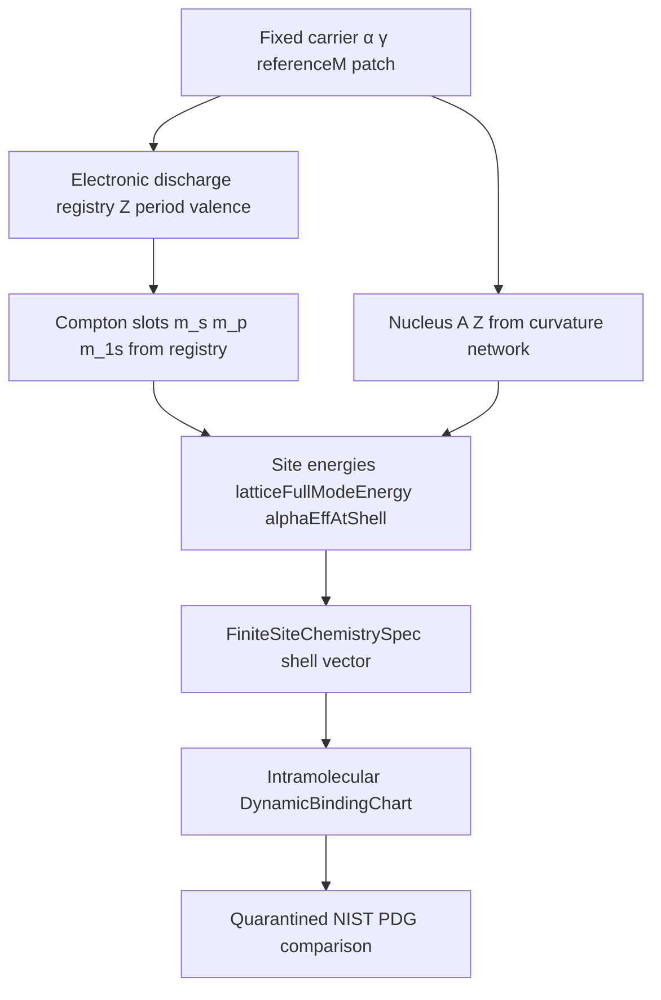

# Atom Construction from HQIV Math (Heavy-Decay Template)

**Status:** architecture + **Phase 1 implemented** (Lean discharge registry, atom assembler, Python pipeline).

**Implemented (2026-06):**

| Artifact | Path |
|----------|------|
| Electronic discharge + uniqueness | `Hqiv/QuantumChemistry/AtomElectronicDischarge.lean` |
| Atom readout from `Z` | `Hqiv/QuantumChemistry/AtomFromCharge.lean` |
| Outside fight + s/p discharge shells | `Hqiv/QuantumChemistry/AtomOutsideCurvatureFight.lean` |
| Slater electronic binding sum | `Hqiv/QuantumChemistry/AtomElectronicBinding.lean` |
| Nuclear `m_nuc(A)` argmin | `Hqiv/QuantumChemistry/AtomNucleusCurvatureShell.lean` |
| Python discharge mirror | `scripts/hqiv_atom_electronic_discharge.py` |
| Stable isotope chart `A(Z)` | `AtomElectronicDischarge.stableMassNumberForCharge`, `scripts/hqiv_atom_stable_chart.py` |
| Continuous ξ per discharge shell | `scripts/hqiv_atom_continuous_xi.py` |
| Python atom builder + quarantined NIST | `scripts/hqiv_atom_construction.py` (`AtomComparisonLayer`) |
| Witness JSON | `data/atom_construction_witnesses.json` |
| Tests | `scripts/test_hqiv_atom_construction.py` |

```bash
lake build Hqiv.QuantumChemistry.AtomElectronicDischarge Hqiv.QuantumChemistry.AtomFromCharge
PYTHONPATH=scripts python3 scripts/hqiv_atom_construction.py
PYTHONPATH=scripts python3 scripts/test_hqiv_atom_construction.py
```

**Mass readout (primary):** closed atomic mass  
`M_atom = M_nucleus + Z·m_e − B_electronic + B_out_fight` (mirrors `BoundStates.M_atom_from_network`).  
For **Z > H**, `B_out_fight` books electrons fighting the nuclear outside caustic load: per-nucleon outside binding × `(4/8)` × `G_eff(θ)` × bonded outside modulator excess × discharge shells. Zero for hydrogen (no nuclear outside stack at A = 1).  
Nuclear tier uses curvature cluster at `m_nuc(A)` (Python) / `referenceM` (Lean scaffold).  
**Goal:** build an **atom** (nucleus + electronic structure + binding readouts) from the same **fixed-carrier → discharge → witness** pipeline that makes heavy decays unique — using math already in [`papers/nucleon_binding`](../papers/nucleon_binding) and Lean `Hqiv/QuantumChemistry/*`.

**Related:** [ALPHA_LEPTON_SHELL_DERIVATION.md](./ALPHA_LEPTON_SHELL_DERIVATION.md) (honest limits on lepton `Nat.find`), [O_MAXWELL_EIGEN_SHELL_SELECTION.md](./O_MAXWELL_EIGEN_SHELL_SELECTION.md), [papers/hep_decay_readout](../papers/hep_decay_readout) (spine uniqueness), [papers/nucleon_binding/scripts/hqiv_shell_shape_geometry.py](../papers/nucleon_binding/scripts/hqiv_shell_shape_geometry.py) (continuous ξ spine).

---

## 1. What “unique like heavy decays” actually means

Heavy decays are **not** unique because we picked PDG branching tables. They are unique because:

1. **Fixed upstream carrier** — `α=3/5`, `γ=2/5`, `referenceM=4`, patch ontology (no feedback from data).
2. **Programmatic channel generation** — daughter pools + kinematic openness + multichannel expansion (not hand-entered modes).
3. **Single contact law** — spine discharge  
   `W(parent, channel, daughters) = ∏_k g_k^{e_k(obs)}`  
   with **binary observables** `e_k ∈ {0,1}` on a **fixed registry** of generators `g_k`.
4. **Uniqueness theorem** — any competitor law that factorizes the same way equals the canonical product (`SpineDischargeUniqueness.lean`, `spineLightProduct_unique_factorization_fn`).
5. **Quarantined comparison** — PDG enters only after prediction; never in formulas.

**Registry scope honesty** (from the decay paper): uniqueness is **given the slot registry**, not “axioms alone fix every PDG mode.” The physical content is in **why the registry is the right discharge alphabet**.

**Atom construction should copy this pattern**, not the lepton `Nat.find` threshold ladder.

---

## 2. What `papers/nucleon_binding` already supplies

The nucleon-binding paper is the **middle layer** of an atom: nucleus + cluster binding + chemistry spine.

| Layer | Mechanism | Repo anchor | Uniqueness today |
|-------|-----------|-------------|------------------|
| **Nucleon mass** | Composite 8×8 trace at `referenceM` | `NuclearCurvatureBinding`, `hqiv_curvature_binding_core.py` | Strong — one witness (`proton_lockin`) |
| **Nuclear binding** | Inside trapped Casimir + outside `G_eff` network on SO(8) contacts | `hqiv_nuclear_inside_outside_binding.py`, TeX §cluster binding | Witness panel ~0.003%–1.2% on light isotopes |
| **Continuous geometry** | `σ(ξ) = (1/ξ)(1+α ln ξ)` — **ξ not integer m** | `hqiv_shell_shape_geometry.py`, `ContinuousXiCoupling.lean` | **Right coordinate** for couplings; holonomy rows are phase budget on ξ |
| **Electronic Compton slots** | TUFT chart: H `1s→m=1`, centre `2s→4`, `2p→3`; period steps on chart | `ElectronicValenceFromTuftChart.lean`, `hqiv_electronic_valence_shells.py` | **Rule from Z** (period, valence count) — not PDG tables |
| **Hydrogenic energy** | `E_0(m,Z,μ) = −μ Z² α_eff(m)²/2` | `BoundStates.lean`, `hqiv_isotope_hydrogenic_scales.py` | Closed form given `(m,Z,μ)` |
| **Site energy / finite patch** | `latticeFullModeEnergy(m)` diagonal trace | `FiniteSiteQuantumChemistry.lean` | Closed form proved |
| **Molecular binding** | Dynamic chart: η·surplus·vev_geomean·κ(ξ)·EV/λ | `DynamicBindingChart.lean`, `hqiv_dynamic_binding_chart.py` | Factorization proved; LiH worked example |
| **Derived chemistry** | Atomic mass from `cluster_mass_mev`; no AMU fit in solve | `hqiv_derived_chemistry.py` | Nuclear ladder only |

**Key insight from nucleon_binding scripts:** integer shell index `m` is a **sample** on continuous horizon coordinate `ξ = m+1 = φ/2`. Physics lives on **ξ ∈ ℝ₊**; electroweak vs Gauss is **two points on one curve**, not three unrelated integers. That is the antidote to “15, 33, 58 are fits.”

---

## 3. End-to-end atom pipeline (target architecture)



### Step A — Nucleus (largely done)

Input: `(Z, N)` or stable `A(Z)`.

Output: `cluster_mass_mev`, `B_in`, `B_out`, meta-horizon shell `m_nuc(A)` from inside-ratio readout.

**No external mass tables in prediction path** (nucleon_binding input policy).

### Step B — Electronic discharge registry (decay-analogue)

Define **observable vector** for the atomic patch:

| Observable | Meaning | Generator / slot |
|------------|---------|------------------|
| `e_period` | principal period from `Z` | `period(Z)` — block logic, not fitted |
| `e_valence` | electrons outside noble core | `valence_electron_count(Z)` |
| `e_h1s` | hydrogen rung active | `m = 1` |
| `e_centre_s` | valence s Compton row | `tuftHeavyChartShell + (period−2)` |
| `e_centre_p` | valence p Compton row | `tuftStrongChartShell + (period−2)` |
| `e_p_active` | p shell participates | S² weight `2ℓ+1 = 3` when period ≥ 2 |

**Target theorem (new):** given registry `𝒢_atom` and factorization axiom (inactive = 1, active = slot assignment), the map  
`(Z) ↦ (m_1s, m_s, m_p, n_e, degeneracy weights)`  
is **unique** — same proof shape as `SpineDischargeUniqueness`.

Python already implements the registry in `hqiv_electronic_valence_shells.electronic_compton_shells(Z)`; Lean has period-2 slots in `ElectronicValenceFromTuftChart.lean`. **Gap:** general period stepping and discharge uniqueness theorem not yet in Lean.

### Step C — Shell indices from ξ, not `Nat.find`

For each electronic slot, assign **ξ** (then `m = ⌊ξ⌋` or band centre):

- Coupling: `1/α_eff(ξ) = 42(1 + c·α·ln(2ξ+1))` (`hqiv_shell_shape_geometry.one_over_alpha_eff_xi`).
- Detuned response: `S_det(ξ)` on continuous curve (`detuned_surface_xi`).
- **Selection rule (to prove):** argmin / eigencondition on modal functional of O–Maxwell + φ at fixed `Z` — **not** first crossing on lepton thresholds 4, 9/4, 16/9.

Lepton outer shells **15/33/58** remain a **separate** charged-lepton mass-ratio chart until replaced; **chemistry atoms** should use **TUFT electronic chart + Z discharge**, already partially wired.

### Step D — Assemble atom = nucleus + electron sites

Structure: `FiniteSiteChemistrySpec n` with `shell : Fin n → ℕ`.

Construction rule (target):

1. One site per electron (or per valence orbital cluster with S² degeneracy weights).
2. Shell label from Step B registry + slot tag (s vs p).
3. Diagonal energy = `latticeFullModeEnergy(m_i)` + Coulomb/trapping corrections from `BoundStates` network sum over SO(8) indices (future).

**Helium / H₂O** scaffolds exist (`HeliumScaffold.lean`, `H2O.lean`); general `(Z)` assembler is the missing piece.

### Step E — Molecules and condensed phase (downstream)

Same as nucleon_binding honest spine: `DynamicBindingChart` for atomization energy; nested-WF bond geometry; `hqiv_lab` for packing — **comparison tables quarantined**.

---

## 4. Heavy decays vs atoms — side by side

| | Heavy decay | Atom (target) |
|---|-------------|---------------|
| **Input** | Parent patch species | `(Z)` or `(Z, N)` |
| **Channel generation** | Multichannel daughter pools | Electronic orbital slots + nuclear cluster contacts |
| **Contact law** | `∏ g_k^{e_k}` spine discharge | `∏ slot_k^{e_k(Z)}` electronic + nuclear discharge |
| **Uniqueness** | `SpineDischargeUniqueness` | **To prove:** `AtomDischargeUniqueness` on fixed registry |
| **Width / energy** | Phase space × ledger × spine weight | `latticeFullModeEnergy` × `alphaEffAtShell` × binding chart |
| **Scale witness** | Masses from meta-resonance chart | `proton_lockin` at `referenceM` |
| **Comparison** | PDG branching | NIST / CODATA / GMTKN55 |

---

## 5. What to **stop** using for atoms

| Anti-pattern | Why |
|--------------|-----|
| Lepton `firstShellAtOrAboveResonanceThreshold` → 15/33/58 | Selector scaffolding; not discharge uniqueness |
| Treating one integer `m` as “the α shell” | α is brace/interaction on **ξ** pairs (`hqiv_shell_shape_geometry`) |
| NIST bond lengths / AMU tables in solve | nucleon_binding input policy forbids |
| Conflating `m_nuc(A)` with electronic Compton `m` | Explicitly separated in `ElectronicValenceFromTuftChart` module doc |
| Claiming uniqueness because `Nat.find` returns one number | Arithmetic uniqueness ≠ physical uniqueness |

---

## 6. Proof program (ordered)

### Phase 1 — Registry + uniqueness (decay template)

- [ ] Lean: `AtomElectronicDischargeRegistry` — observables + generators for `(Z) → Compton triplet`.
- [ ] Lean: `AtomDischargeUniqueness` — factorization theorem mirroring `SpineDischargeUniqueness`.
- [ ] Wire `electronic_compton_shells(Z)` Python ↔ Lean names; extend beyond period-2 in Lean.

### Phase 2 — Continuous ξ selection (replace integer fits)

- [ ] Formalize `detuned_surface_xi`, `one_over_alpha_eff_xi` in Lean (mirror `hqiv_shell_shape_geometry.py`).
- [ ] Variational or dispersion **functional** whose minimizer picks ξ per slot (close `O_MAXWELL_EIGEN_SHELL_SELECTION` criterion).
- [ ] Document lepton outer shells as **legacy chart** or re-derive from same functional with winding index `n`.

### Phase 3 — Full atom assembler

- [x] `atomClosedMassMeV` / `M_atom = M_nucleus + Z·m_e − B` (Python + Lean scaffold)
- [x] Continuous ξ witness per discharge shell
- [x] First-ionization prediction witness (Slater on discharge occupancy)
- [ ] `AtomFromCharge Z : FiniteSiteChemistrySpec` — constructive definition (partial: `atomFiniteSiteSpec`)
- [x] Lean `atomElectronicOutsideCurvatureFightMeV` + s/p `atomElectronShellForIndex`
- [x] Lean `nucleusCurvatureShellArgmin` with formula-derived `ℚ` spine + `native_decide` on benchmark isotopes
- [x] Lean `trappedPlanckCumulativeBudget_eq_four_mul` — Planck factor is **proved** linear, not pasted
- [x] Lean `metaHorizonInsideRatioComputational` — inside ratio from `shellShapeComputational` + index ratio
- [ ] Prove `ℚ` computational inside ratio = `ℝ` `metaHorizonTrappedInsideRatio` (log witness bridge)
- [ ] Prove strict monotonicity of inside ratio on shell index (bracket argmin without panel pins)
- [ ] Connect closed mass to `hqiv_derived_chemistry` optional tier

### Phase 4 — Structural witnesses (like decay 81/81)

- [ ] Export JSON witness panel: predicted ionization scales, atomization (GMTKN55 comparison only), noble-gas periods.
- [ ] Lean certificates: normalization, nonnegativity, discharge reconciliation on benchmark elements H, He, Li, C, O, Na.

---

## 7. Immediate usable spine (today)

Even before Phase 1–3 close, you **can** build a **derived atom readout** now:

```text
Z
 → stable A(Z), m_nuc from curvature binding
 → cluster_mass_mev / derived_atomic_mass_amu
 → electronic_compton_shells(Z) from TUFT chart + period rule
 → alphaEffAtShell(m), expectedGroundEnergyAtShell for hydrogenic scales
 → FiniteSiteChemistrySpec from shell vector + S² weights
 → DynamicBindingChart for molecules
```

This path **does not** use lepton 15/33/58. It **does** use TUFT chart rows `(1,3,4)` + period offset — still **named defs**, but discharge-style from `Z` without PDG.

Run nucleon_binding witnesses:

```bash
PYTHONPATH=scripts python3 papers/nucleon_binding/scripts/hqiv_electronic_valence_shells.py
PYTHONPATH=scripts python3 papers/nucleon_binding/scripts/hqiv_shell_shape_geometry.py
PYTHONPATH=scripts python3 papers/nucleon_binding/scripts/hqiv_isotope_hydrogenic_scales.py
```

---

## 8. Lean entry points (atom program)

| Module | Role |
|--------|------|
| `Hqiv/Physics/BoundStates.lean` | `alphaEffAtShell`, `expectedGroundEnergyAtShell` |
| `Hqiv/Physics/NuclearCurvatureBinding.lean` | Cluster binding network |
| `Hqiv/Physics/ContinuousXiCoupling.lean` | Brace / holonomy on ξ |
| `Hqiv/Physics/SpineDischargeUniqueness.lean` | **Template** for atom discharge uniqueness |
| `Hqiv/QuantumChemistry/ElectronicValenceFromTuftChart.lean` | Electronic Compton slots |
| `Hqiv/QuantumChemistry/DynamicBindingChart.lean` | Molecular binding factorization |
| `Hqiv/QuantumChemistry/FiniteSiteQuantumChemistry.lean` | Site energy trace |
| `Hqiv/Physics/HepDecayReadout.lean` | Discharge observable pattern reference |

---

*The nucleon_binding stack already proves that **nuclei and molecules** can be read from composite trace + curvature network with quarantined comparison. The missing piece for “build an atom uniquely” is the **electronic discharge registry + ξ-selection theorem** — copy heavy decays’ algebra, not lepton threshold `Nat.find`.*
