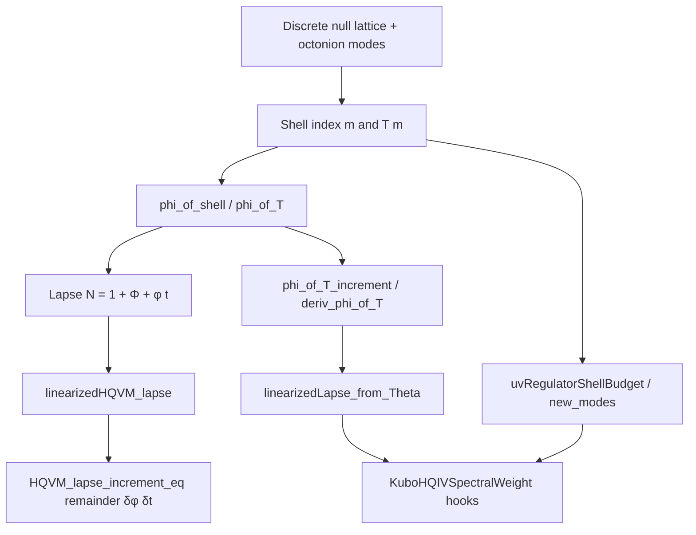

# HQIV × perturbation theory — roadmap (honest scope)

HQIV already contains **real** perturbation-style analysis in a **narrow, observer-centric** sense. This note explains what is **proved**, what is **classical GR/QFT** (and intentionally not replayed), and how to extend the ladder without smuggling in a global FLRW gauge or fitted parameters.

**Companion Lean:** `Hqiv/Geometry/HQVMPerturbations.lean` (core); `Hqiv/Physics/HQIVPerturbationScaffold.lean` (shell-indexed specializations + links to [LIGHTCONE_FUNDAMENTALS_DERIVATION_PLAN.md](./LIGHTCONE_FUNDAMENTALS_DERIVATION_PLAN.md) Pillar **C**).

**Related roadmaps:** [FLUID_OMAXWELL_ROADMAP.md](./FLUID_OMAXWELL_ROADMAP.md) (effective fluid + O-Maxwell), [MANIFOLD_ZETA_ROADMAP.md](./MANIFOLD_ZETA_ROADMAP.md) (global `φ·t` / Ricci-weighted δ_E), [LIGHTCONE_FUNDAMENTALS_DERIVATION_PLAN.md](./LIGHTCONE_FUNDAMENTALS_DERIVATION_PLAN.md) (kinetic → Kubo).

---

## 1. Why this is “light” compared to textbooks

| Textbook topic | HQIV stance |
|----------------|-------------|
| **Bardeen / gauge-fixed GR perturbations** | **Not** the formal target. HQVM is **inhomogeneous** by construction; a single global synchronous gauge story is not assumed. See module doc of `HQVMPerturbations`. |
| **Matter transfer functions / Boltzmann hierarchy** | **Not** in Lean as a coupled system. CLASS alignment uses the **homogeneous** slice + dictionary hooks (`HQVMCLASSBridge`, `HQVMConsistency`); full hierarchy is **paper/code**, not Mathlib. |
| **What *is* formal** | **Algebra of small deviations** in the objects the **two axioms** already fix: lapse `N = 1 + Φ + φ t`, auxiliary field `φ` from `phi_of_T` / shells, and **discrete** mode budgets. |

So “light” does **not** mean empty: it means **deliberately not** duplicating a 200-page cosmological perturbation pipeline until each ingredient is tied back to the light-cone + monogamy spine.

It also means **not** smuggling in a physically fundamental sub-Planck continuum. In this repo, the
discrete null lattice / shell ladder is the UV substrate. The continuum calculus used in perturbation
files is an **effective IR language** for observer-side normalization, transport, and metric readout.
Derivatives here are bookkeeping on top of shell data, not evidence for an ontic smooth manifold below
the lattice cutoff.

---

## 2. What is already anchored (use these names)

### 2.1 Lapse linearization (first order in δΦ, δφ, δt)

- `Hqiv.linearizedHQVM_lapse` — differential of `HQVM_lapse`.
- `Hqiv.HQVM_lapse_increment_eq` — exact increment; remainder **only** `δφ δt` beyond linear part.
- `Hqiv.HQVM_lapse_increment_homogeneous` — `Φ_bg = 0`, `φ_bg = H` slice.

**Interpretation:** This is the **honest HQIV analogue** of “linearized lapse” without importing a full 3+1 splitting theorem.

### 2.2 Auxiliary field / temperature channel

- `Hqiv.phi_of_T_increment`, `Hqiv.deriv_phi_of_T` — exact increment and derivative of `phi_of_T`.
- `Hqiv.linearizedLapse_from_Theta`, `Hqiv.linearizedLapse_from_Theta_eq_phi_channel` — lapse response through **Θ → φ** only.
- `Hqiv.Physics.rapidityNormalizedShellPhiIncrement`, `linearizedLapse_from_shell_rapidityNormalized`, `HQVM_lapse_increment_shell_rapidityNormalized`, `HQVM_g_tt_increment_shell_rapidityNormalized`, `HQVM_spatial_coeff_increment_zero_of_pure_phi_channel`, `HQVM_metric_shell_rapidityNormalized_phiChannel_timelikeOnly` — observer-side **rapidity normalization** of that same shell-induced `δφ`; the perturbation story stays a lapse/clock response, now has a clean geometry-facing readout in the timelike metric coefficient `g_tt = -N^2`, and explicitly records that the spatial coefficient does **not** move at this rung unless extra `δa` / `δΦ` structure is supplied.
- `Hqiv.Physics.rapidityNormalizedPotentialIncrement`, `HQVM_spatial_coeff_increment_rapidityNormalizedPotential`, `HQVM_metric_shell_rapidityNormalized_withPotentialChannel` — the minimal extra spatial structure: a separately supplied but observer-budget-normalized `δΦ` gives the first theorem-backed movement of `HQVM_spatial_coeff`, still without claiming a full GR perturbation package or sub-cutoff continuum dynamics.

**Interpretation:** “Perturbation” of the **temperature ladder** is the same object as perturbation of the **φ** driving O-Maxwell / metric; no separate knob.

### 2.3 Resolution and spatial chart (QM-compatible)

- `Hqiv.energyTimeResolutionScale`, `Hqiv.timeIncrementSubResolution` — τ = ħ/ΔE scale; **sub-resolution** predicate on `δt`.
- `Hqiv.ObserverChart`, `Hqiv.observerBall` — same ℝ³ chart as `Schrodinger.Position` for later PDE-localized statements.

**Interpretation:** Perturbations in **time** are tied to **energy resolution** (same functional form as resonance width in `SpinStatistics`), not a free infinitesimal.

### 2.4 Discrete / continuum dictionary (not full dynamics)

- `HQVMDiscreteLaplacian`, `HQVMGlobalLocalDictionary`, `HQVMConsistency` — finite differences, ball means, consistency of **scalar** lapse increments with discrete Poisson scaffolding.

**Interpretation:** Spatial **linear** operators exist in **scaffold** form; identification with a full elliptic PDE on a manifold is [MANIFOLD_ZETA_ROADMAP.md](./MANIFOLD_ZETA_ROADMAP.md)-level work.

### 2.5 Plasma / EM linearization

- `SchematicPlasmaCurrent` — `linearisedScalarPerturbation`, links to emergent Maxwell in a **stated** limit.

### 2.6 Kubo / response (pillar plan)

- `Hqiv.Physics.KuboHQIVSpectralWeight` in `LightConeFundamentalsPillars` — **formal** weights; **not** yet Green–Kubo coefficients.

---

## 3. Conceptual map: axiom → perturbation object

---

## 4. Milestones (P0–P5) — suggested order

| ID | Goal | Artifact |
|----|------|----------|
| **P0** | Lock **shell-indexed** Θ = `T m` in response lemmas | `HQIVPerturbationScaffold` (specializations + re-exports) |
| **P1** | State **joint** smallness: `|δΘ|`, `|δt|` vs `T m`, `energyTimeResolutionScale` | `Prop` bundles in `HQIVPerturbationScaffold` or `HQVMPerturbations` |
| **P2** | Bound **bilinear** lapse remainder `δφ δt` when `δφ` comes from `phi_of_T_increment` | inequality lemmas (needs explicit bounds on δΘ) |
| **P3** | Wire **KuboHQIVSpectralWeight** to `deriv_phi_of_T` and `deltaE` slots | `LIGHTCONE_FUNDAMENTALS_DERIVATION_PLAN` §3 + new `structure` |
| **P4** | Couple **fluid** linearization (`HQIVFluidClosureScaffold`) to `linearizedHQVM_lapse` via shared φ, Θ | hypothesis table like FLUID roadmap §F2 |
| **P5** | Optional: **mode-truncated** Hilbert space (finite shell) + norm of perturbation | `QuantumMechanics` / `DiscreteQuantumState` bridge |

---

## 5. Explicit non-goals (do not claim in Lean without new axioms)

- Global existence of solutions for **full** coupled perturbation PDEs.
- Identification of HQIV Bardeen potentials with **CDM** transfer functions.
- Automatic **Weyl** / tensor perturbations from the scalar ladder alone.
- A physically primary **sub-Planck continuum** from which the lattice is recovered only as an approximation.
- Exact recovery of textbook GR perturbation theory at arbitrarily short distances.

---

## 6. Maintainer note

When adding a **new** proved perturbation lemma that agents should rely on, add one line under **§2** here (or in [THEOREMS.md](./THEOREMS.md)) pointing to the Lean name. When adding **hypothesis** bundles only, label them in the module doc and in [ASSUMPTIONS.md](./ASSUMPTIONS.md) if they introduce `sorry` or script trust.
