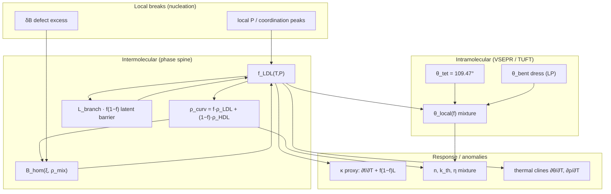

# Water LDL/HDL — refinement program (full story)

**Status:** architecture + open witnesses (2026-07)  
**Literature (comparison only):** [LITERATURE_WATER_TWO_STATE.md](./LITERATURE_WATER_TWO_STATE.md), Kim compressibility ~229 K, Sciortino LLCP, Li A⇌B  
**Phase engine:** `hqiv_lab/phase_diagram.py`, `Hqiv.QuantumChemistry.PhaseDiagramMixture`

This document ties the **H–O–H angle gap**, **two-liquid mixture**, **thermal clines**, **latent barrier**, **outside curvature**, and **nucleation / local pressure peaks** into one refinement arc. We do not expect one pass to close every residual; the goal is a rigorous story we can tighten theorem-by-theorem.

---

## 1. Three angles (do not conflate)

| Label | Value | HQIV source | Role |
|-------|-------|-------------|------|
| **θ_tet** | 109.47° | `VSEPRFromBalance` / `centreAngleRadFromDomains 4` — cos θ = −⅓ | **LDL end member**: tetrahedral H-bond network reference (ice-like local order) |
| **θ_gas (ref)** | **104.478°** (±0.01°) | NIST CCCBDB / Hoy & Bunker 1979 — **comparison quarantine only** | Median experimental gas-phase witness; see [LITERATURE_WATER_HOH_ANGLE.md](./LITERATURE_WATER_HOH_ANGLE.md) |
| **θ_dyn** | ~104.471° (today) | `dynamicCentreAngleRad 8 2` = θ_tet − (4/8)·n_lp/(n_domains+n_bonds)·(π/6) | Current gas-phase derivation; ~0.007° low vs 104.478° comparison |

**Arena / showcase row “109.47 vs 104.478”** is correct to flag: HQIV’s **proved** tetrahedral cosine is not the same object as the **measured** gas-phase angle. Collapsing them was the bug.

**Refinement R-θ (landed as witness):** the torque-tree screening denominator includes both steric domains and covalent bond leaves, giving the water factor `n_lp/(n_domains+n_bonds)=2/6`. 104.478° still grades readouts only; no `rfl` or tabulated angle enters the definition.

---

## 2. LDL / HDL as a coupled stack (not just ρ_curv)



**End members (structural, not fitted):**

| Branch | ρ_curv | θ_HOH (target) | G_eff(θ) @ ρ |
|--------|--------|----------------|--------------|
| LDL | `tetrahedralMeltDensityRatio` | θ_tet (109.47°) | rises with ρ toward network |
| HDL | melt comparison (1) | θ_gas ref / θ_dyn | bulk liquid release |

**Mixture slots (landed in Python; Lean mirrors in progress):**

- `liquidMixtureCurvatureFraction f …`
- `mixtureLatentBarrierFactor f = f(1−f)`
- `liquidBranchBarrierPotential (1−2f)·L_branch`
- `liquidHomogeneousCurvatureFeedback γ·α·(B_hom−1)`
- `materialResponseMixture` for n, k_th, η
- `hoh_angle_mixture_deg(f)` — **new witness** (this doc)

---

## 3. Self-consistent loop (current)

At each (T, P):

1. Seed `f` from bare cohesive gap.
2. `ρ_mix(f)` → dress `B_hom`, `(1−2f)·L_branch`.
3. Update `ΔE` → Boltzmann `f` until fixed point.
4. Optional: `θ_local(f)` for optical / Clausius–Mossotti / dipole slots.

**Missing for Kim ~229 K Widom peak:** metastable-liquid **window** gating so susceptibility turns over in the supercooled band (`T > T_melt·γ·α`), not monotonic to scan floor.

---

## 4. Thermal clines (next tier)

**Thermal cline** = coupled T-derivatives along the same spine (no new fits):

| Cline | Definition | Modules |
|-------|------------|---------|
| ∂ρ_curv/∂T | via `f_LDL(T)` | `phase_diagram.py` |
| ∂θ/∂T | via `θ_local(f(T))` | `hqiv_chemistry_tuft_dynamics.py`, mixture hook |
| ∂n/∂T | mixture material response | `hqiv_phase_material_response.py` |
| ∂κ_proxy/∂T | Widom slot | `widom_line_compressibility_proxy` |

**Hypothesis (falsifiable):** in supercooled 1 atm band, ∂θ/∂T and ∂f/∂T **co-peak** where LDL-like order fluctuates — qualitative analogue of Kim compressibility maximum (comparison grades location, never input).

---

## 5. Nucleation & local pressure peaks

From [HOMOGENEOUS_CURVATURE_SECOND_ORDER.md](./HOMOGENEOUS_CURVATURE_SECOND_ORDER.md):

- Bulk: `B_hom(ξ, ρ)`.
- Defect: `δB = γ·(4/8)·max(ρ_local − ρ_hom, 0)`.
- Effective: `B_eff = B_hom + δB` → binding / melt / **local f_LDL bias**.

**Story at a nucleation site (dust, surface, protein interface):**

1. `ρ_local` spike → `δB > 0`.
2. Local `f_LDL` rises (tetrahedral template) → θ_local → θ_tet.
3. Coordination excess → **local compressibility / P response peak** (loop vs semi-loop topology in Li et al. — comparison only).
4. Protein hydrophobic dress (`ProteinSolventPhaseGeometry`) is the **macromolecular** analogue.

**Python:** extend `hqiv_homogeneous_curvature_feedback.self_consistent_homogeneous_feedback` with `f_LDL` at defect sites; audit in `data/homogeneous_curvature_feedback.json`.

---

## 6. Known residuals (honest)

| Witness | HQIV | Comparison | Notes |
|---------|------|------------|-------|
| H–O–H gas | θ_dyn ≈ 104.471° | 104.478° (Hoy & Bunker / NIST) | Torque-tree screening witness; comparison residual ~0.007° |
| H–O–H tetrahedral | 109.47° | ice/network | Correct as **LDL** end member, wrong as gas |
| Widom peak T | scan floor ~150 K | Kim ~229 K | κ proxy monotone; needs window + ∂² slot |
| LLCP (T,P) | metastable @ 198 K / 1250 atm | Sciortino | Structural pass; distance metric grades |
| L_fusion | ~10 kJ/mol slot | ~6 kcal/mol | Order-of-magnitude; branch barrier uses fraction |

---

## 7. Refinement tiers (rigorous order)

| Tier | Work | Lean | Python | Arena metric (candidate) |
|------|------|------|--------|------------------------|
| **R0** | Document + mixture θ witness | `PhaseDiagramMixture` | `hoh_angle_*` | showcase row |
| **R1** | TUFT θ_gas from torque-tree denominator | `DynamicCentreGeometry` | `dynamic_centre_angle_rad` | `h2o_bond_angle_residual_deg` |
| **R2** | θ_local(f) in material response | `PhaseMaterialResponse` | mixture CM / η | optical n(T) cline |
| **R3** | Metastable window on κ proxy | `metastableLiquidAccessible` | `widom_*` | `water_widom_peak_*` |
| **R4** | Nucleation δB → local f, P | `HomogeneousCurvatureSecondOrder` | defect audit grid | nucleation proxy |
| **R5** | Full thermal cline audit | — | `(T) grid export` | multi-cline pass rate |

---

## 8. Anti-patterns

- Do **not** set `waterBondAngleDeg := 104.5` by `rfl` as a derivation input.
- Do **not** use 109.47° in gas-phase GMTKN55 rows where θ_dyn or θ_gas ref belongs.
- Do **not** fit Kim 229 K or Sciortino LLCP into `f_LDL` or θ dress.
- Comparison quarantine unchanged.

---

## 9. Commands

```bash
# Mixture + angle witnesses
PYTHONPATH=.:scripts python3 -c "
from hqiv_lab.phase_diagram import hoh_angle_witness_row
from hqiv_lab.spec import resolve_spec
from hqiv_lab.phase_diagram import material_scales_for_spec, low_density_liquid_fraction
import hqiv_thermodynamic_phase_from_tp as tptp
mat = material_scales_for_spec(resolve_spec('H2O'), bulk=True)
for T in (200, 229, 273, 310):
    f = low_density_liquid_fraction(T, tptp.STP_PRESSURE_PA, mat)
    print(T, hoh_angle_witness_row(f))
"

lake build Hqiv.QuantumChemistry.PhaseDiagramMixture Hqiv.Physics.DynamicCentreGeometry
PYTHONPATH=.:scripts python3 scripts/test_hqiv_phase_diagram.py
```

---

## 10. Related docs

- [archive/PHASE_GEOMETRY_CURVATURE_DENSITY.md](./archive/PHASE_GEOMETRY_CURVATURE_DENSITY.md)
- [HOMOGENEOUS_CURVATURE_SECOND_ORDER.md](./HOMOGENEOUS_CURVATURE_SECOND_ORDER.md)
- [archive/CHEMISTRY_TUFT_DYNAMICS_PROOF_PROGRAM.md](./archive/CHEMISTRY_TUFT_DYNAMICS_PROOF_PROGRAM.md)
- [LITERATURE_WATER_TWO_STATE.md](./LITERATURE_WATER_TWO_STATE.md)
