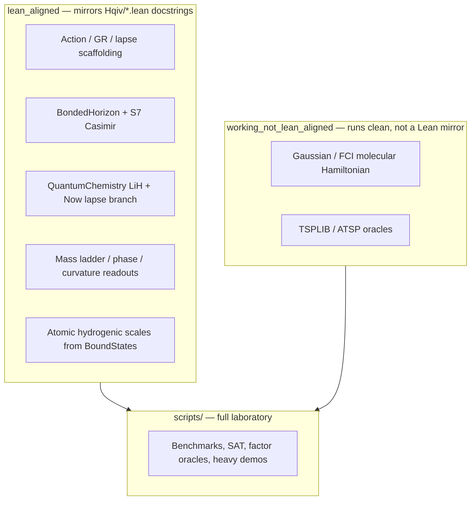

# The Tech Tree

Curated entry points for **numeric mirrors** of the formalized Lean stack, plus a **working-but-not-Lean** lane for standard tooling (QC, benchmarks, oracles).

**Authoritative code** still lives under `scripts/`; files here are thin `runpy` wrappers so names can encode alignment status without breaking relative imports inside the originals.

## Audit sweep

- Runner: `run_audit.py` (executes every top-level `scripts/*.py` with CWD=`scripts/`, 30s timeout).
- Latest machine results: `AUDIT_RESULTS.md` / `AUDIT_RESULTS.json`.

Last run summary: **129** scripts — **76** exit 0, **53** timeout / nonzero exit (see `AUDIT_RESULTS.md`).

## Map (where we are)

| Lane | Meaning |
|------|---------|
| `lean_aligned/` | Docstring names a `Hqiv/...lean` module (or a proved identity chain); preferred for “same equations as Lean”. |
| `working_not_lean_aligned/` | Passes `run_audit.py` but is **standard** numerics, heuristics, or external-problem oracles — not a claim of Lean equivalence. |
| `scripts/` only | Everything else: benchmarks that **timeout** at 30s, failing checks, ZK export, etc. Treat as **archive / lab** unless promoted. |

**Physical archive:** Existing demotions live under `archive/scripts/` (older experiments). This tech tree does **not** mass-move `scripts/` (would break paths and CI); promotion is **by wrapper + README** until you explicitly migrate imports.

## `lean_aligned/` index

| Wrapper | Canonical script | Lean touchpoints (typical) |
|---------|------------------|----------------------------|
| `Orbital-Mechanics-OMaxwell-Aligned.py` | `omaxwell_torus_ode.py` | O-Maxwell / torus potential scaffold (numeric prototype) |
| `BondedHorizon-Casimir-Lean.py` | `bonded_horizon_casimir_float.py` | `Hqiv/Geometry/BondedHorizonCasimir.lean` |
| `NuclearTorus-S7Casimir-Lean.py` | `nuclear_torus_casimir_float.py` | `NuclearTorusPerturbation`, `S7MetahorizonCasimir` |
| `LiH-QuantumChemistry-Now-Lapse-LeanAligned-Working.py` | `lih_derivation_scan.py` | `LiH.lean`, `LiHDerivation.lean`, `Now.lean`, EL residual mirror of `Action.lean` |
| `BulkEquivalent-Baryogenesis-OctonionicLightCone-Lean.py` | `run_bulk_equivalent.py` | `OctonionicLightCone`, baryogenesis ladder |
| `PhaseRelax-MassLadder-cubic_phase_relax_probe-Lean.py` | `cubic_phase_relax_probe.py` | Fano / quark / lepton / detuning stack (as documented in file header) |
| `CurvatureOntology-HQVMetric-OctonionicLightCone-Lean.py` | `hqiv_curvature_information_ontology.py` | Curvature integral, `HQVM_lapse`, ontology readout |
| `BoundStates-HydrogenicScales-Lean.py` | `hqiv_isotope_hydrogenic_scales.py` | `BoundStates.lean`, `AuxiliaryField.lean` |
| `BoundStates-IsotopeInventory-Lean.py` | `hqiv_isotope_inventory.py` | Same + GTO scaffolding |
| `UniversalDynamics-Equations-Lean.py` | `universal_dynamics_equations.py` | Check module list in script header |
| `FragmentAware-BondedHorizon-Lean.py` | `fragment_aware_bonded_horizon.py` | Molecular fragments on bonded surplus |
| `LeanOctonion-Print-L-matrices.py` | `print_lean_octonion_L.py` | Octonion left mul table parity checks |

## `working_not_lean_aligned/` index (sample)

| Wrapper | Canonical script | Note |
|---------|------------------|------|
| `QuantumChem-GaussianFCI-NotLeanAligned-Working.py` | `hqiv_molecular_hamiltonian.py` | Ordinary quantum chemistry; Lean is a separate layer |
| `QuantumChem-CartesianGaussian-NotLeanAligned-Working.py` | `hqiv_cartesian_gaussian.py` | Same |
| `Combinatorics-ATSP-Oracle-NotLeanAligned-Working.py` | `geometric_tsp_oracle.py` | Optimization oracle, not physics formalization |

Add more wrappers by copying an existing wrapper and changing `TARGET = "....py"`.

## Promotion checklist

1. Script documents explicit `Hqiv/...lean` paths in its module docstring.
2. `python3 the_tech_tree/run_audit.py` → exit 0 for that file (or justify longer runtime / CLI flags).
3. Add wrapper under `lean_aligned/` or `working_not_lean_aligned/` and a row in this README.

## Next gaps (honest)

- No single Python file yet mirrors **`E_bind_from_composite_trace`** end-to-end for nucleon binding (Lean: `BoundStates.lean` + `QuarkMetaResonance.lean`); `lih_derivation_scan.py` covers chemistry + `EL_O_general` diagnostics, not full QCD network binding.
- **`check_fano_mass_coherence.py`** currently **fails** the audit (see `AUDIT_RESULTS.md`); repair before promoting to `lean_aligned/`.
